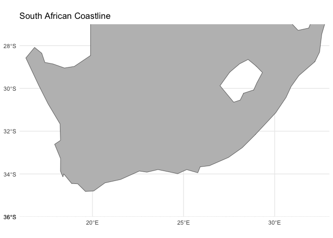
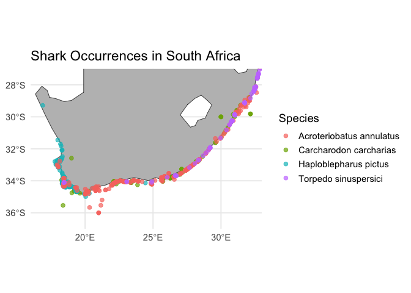

# GISMap


## Background:

This document explains the process and steps taken to produce the GIS
map

Shark distribution data was obtained from GBIF - data were collected for
South African shores only and for the following species: *Acroteriobatus
annulatus* (Lesser guitarfish/ sandshark), *Carcharodon carcharias*
(white shark), *Haploblepharus pictus* (dark shyshark) and *Torpedo
sinuspersici* (Gulf torpedo/ variable electric ray).

Note: AI (ChatGPT) was used to aid with code in some parts.

## Code:

Downloading and calling necessary packages:

``` r
options(repos = c(CRAN = "https://cloud.r-project.org/"))
install.packages("rgbif")
```


    The downloaded binary packages are in
        /var/folders/fg/zchsqwnj4b76b_yds9qbvmyc0000gn/T//Rtmpq5GYbr/downloaded_packages

``` r
install.packages("sf")
```


    The downloaded binary packages are in
        /var/folders/fg/zchsqwnj4b76b_yds9qbvmyc0000gn/T//Rtmpq5GYbr/downloaded_packages

``` r
install.packages("terra")
```


    The downloaded binary packages are in
        /var/folders/fg/zchsqwnj4b76b_yds9qbvmyc0000gn/T//Rtmpq5GYbr/downloaded_packages

``` r
install.packages("tidyverse")
```


    The downloaded binary packages are in
        /var/folders/fg/zchsqwnj4b76b_yds9qbvmyc0000gn/T//Rtmpq5GYbr/downloaded_packages

``` r
install.packages("dplyr")
```


    The downloaded binary packages are in
        /var/folders/fg/zchsqwnj4b76b_yds9qbvmyc0000gn/T//Rtmpq5GYbr/downloaded_packages

``` r
install.packages("ggplot2")
```


    The downloaded binary packages are in
        /var/folders/fg/zchsqwnj4b76b_yds9qbvmyc0000gn/T//Rtmpq5GYbr/downloaded_packages

``` r
install.packages("ggspatial")
```


    The downloaded binary packages are in
        /var/folders/fg/zchsqwnj4b76b_yds9qbvmyc0000gn/T//Rtmpq5GYbr/downloaded_packages

``` r
install.packages("leaflet")
```


    The downloaded binary packages are in
        /var/folders/fg/zchsqwnj4b76b_yds9qbvmyc0000gn/T//Rtmpq5GYbr/downloaded_packages

``` r
install.packages("maps")
```


    The downloaded binary packages are in
        /var/folders/fg/zchsqwnj4b76b_yds9qbvmyc0000gn/T//Rtmpq5GYbr/downloaded_packages

``` r
install.packages("rnaturalearth")
```


    The downloaded binary packages are in
        /var/folders/fg/zchsqwnj4b76b_yds9qbvmyc0000gn/T//Rtmpq5GYbr/downloaded_packages

``` r
install.packages("rnaturalearthdata")
```


    The downloaded binary packages are in
        /var/folders/fg/zchsqwnj4b76b_yds9qbvmyc0000gn/T//Rtmpq5GYbr/downloaded_packages

``` r
install.packages("rnaturalearthhires")
```

    Warning: package 'rnaturalearthhires' is not available for this version of R

    A version of this package for your version of R might be available elsewhere,
    see the ideas at
    https://cran.r-project.org/doc/manuals/r-patched/R-admin.html#Installing-packages

``` r
library(rgbif)
library(maps)
library(ggplot2)
library(dplyr)
```


    Attaching package: 'dplyr'

    The following objects are masked from 'package:stats':

        filter, lag

    The following objects are masked from 'package:base':

        intersect, setdiff, setequal, union

``` r
library(tidyverse)
```

    ── Attaching core tidyverse packages ──────────────────────── tidyverse 2.0.0 ──
    ✔ forcats   1.0.1     ✔ stringr   1.6.0
    ✔ lubridate 1.9.5     ✔ tibble    3.3.1
    ✔ purrr     1.2.1     ✔ tidyr     1.3.2
    ✔ readr     2.1.6     

    ── Conflicts ────────────────────────────────────────── tidyverse_conflicts() ──
    ✖ dplyr::filter() masks stats::filter()
    ✖ dplyr::lag()    masks stats::lag()
    ✖ purrr::map()    masks maps::map()
    ℹ Use the conflicted package (<http://conflicted.r-lib.org/>) to force all conflicts to become errors

``` r
library(sf)
```

    Linking to GEOS 3.13.0, GDAL 3.8.5, PROJ 9.5.1; sf_use_s2() is TRUE

``` r
library(maps)
library(rnaturalearth)
```

Plot base map:

``` r
sa <- ne_countries(country = "South Africa", returnclass = "sf")

ggplot() +
  geom_sf(data = sa, fill = "gray", color = "black") +
  coord_sf(
    xlim = c(16, 33),   # longitude range
    ylim = c(-36, -27), # latitude range
    expand = FALSE
  ) +
  theme_minimal() +
  labs(title = "South African Coastline")
```



Load shark species data from GBIF and check structure

``` r
species <- c(
  "Carcharodon carcharias",
  "Haploblepharus pictus",
  "Acroteriobatus annulatus",
  "Torpedo sinuspersici"
)

get_species_data <- function(sp){
  
  key <- name_backbone(name = sp)$speciesKey
  
  occ <- occ_search(
    taxonKey = key,
    hasCoordinate = TRUE,
    country = "ZA", 
    limit = 2000
  )
  
  data <- occ$data %>%
    select(species, decimalLongitude, decimalLatitude) %>%
    na.omit()
  
  return(data)
}

shark_data <- bind_rows(lapply(species, get_species_data))

shark_sf <- st_as_sf(
  shark_data,
  coords = c("decimalLongitude","decimalLatitude"),
  crs = 4326
)

st_crs(shark_sf)
```

    Coordinate Reference System:
      User input: EPSG:4326 
      wkt:
    GEOGCRS["WGS 84",
        ENSEMBLE["World Geodetic System 1984 ensemble",
            MEMBER["World Geodetic System 1984 (Transit)"],
            MEMBER["World Geodetic System 1984 (G730)"],
            MEMBER["World Geodetic System 1984 (G873)"],
            MEMBER["World Geodetic System 1984 (G1150)"],
            MEMBER["World Geodetic System 1984 (G1674)"],
            MEMBER["World Geodetic System 1984 (G1762)"],
            MEMBER["World Geodetic System 1984 (G2139)"],
            MEMBER["World Geodetic System 1984 (G2296)"],
            ELLIPSOID["WGS 84",6378137,298.257223563,
                LENGTHUNIT["metre",1]],
            ENSEMBLEACCURACY[2.0]],
        PRIMEM["Greenwich",0,
            ANGLEUNIT["degree",0.0174532925199433]],
        CS[ellipsoidal,2],
            AXIS["geodetic latitude (Lat)",north,
                ORDER[1],
                ANGLEUNIT["degree",0.0174532925199433]],
            AXIS["geodetic longitude (Lon)",east,
                ORDER[2],
                ANGLEUNIT["degree",0.0174532925199433]],
        USAGE[
            SCOPE["Horizontal component of 3D system."],
            AREA["World."],
            BBOX[-90,-180,90,180]],
        ID["EPSG",4326]]

Plot map:

``` r
ggplot() +
  geom_sf(data = sa, fill = "gray", color = "black") +   # base map
  geom_sf(data = shark_sf, aes(color = species), size = 2, alpha = 0.7) +  # points
  coord_sf(xlim = c(16, 33), ylim = c(-37, -27), expand = FALSE) +  # zoom to coastline
  theme_minimal(base_size = 14) +
  labs(
    title = "Shark Occurrences in South Africa",
    color = "Species"
  )
```




